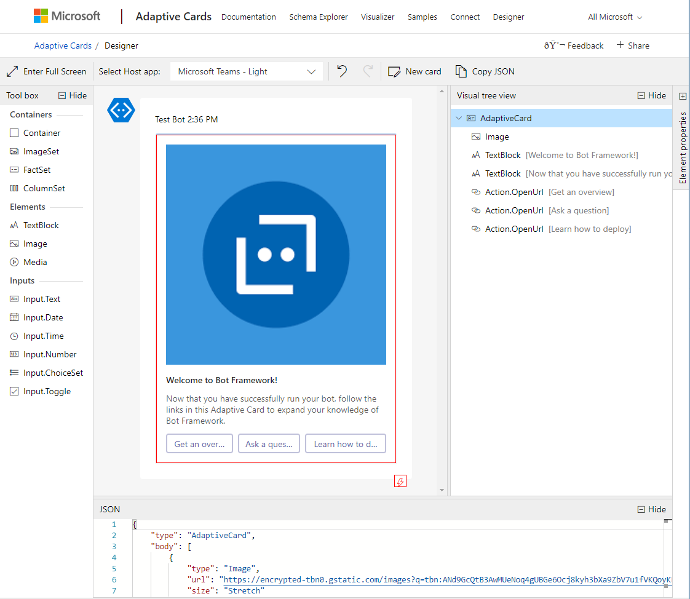
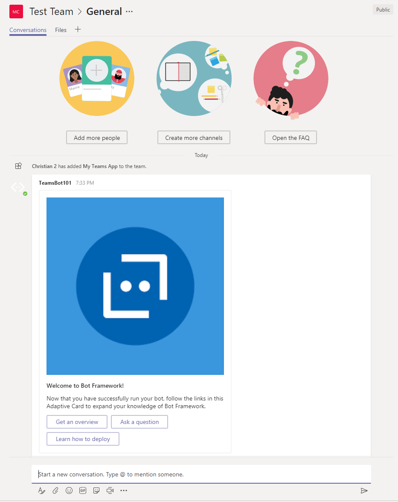

# Microsoft Teams - Bot Training
## Lab 2 - Adaptive Cards

Adaptive Cards are an open framework for card-based UI that are designed to work cross platforms. Adaptive Cards are a great fit for Bots. They let you author cards and let it render beautifully inside of most the bot channels like for example in Microsoft Teams or Skype.

Because it is a good bot design principle that Bots introduce themselves and tell the users how they can help we will wcreate a Welcome Card in this lab. 

- Setup the bot like described in [Lab 1](./bot-lab-1.md)
- Install the AdaptiveCard Library 
```bash
dotnet add package AdaptiveCards
dotnet restore
```
- Open the App Studio Teams App again and navigate to the Card Editor. The editor allows you to create and  preview cards and to send you the cards as chat message. 
- However in our lab we are going to use the Adaptive Card Designer (https://adaptivecards.io/designer/). This designer has a much richer experience. Play around with the designer and create your own welcome card.




- Optional: When you are done you can test the card in App Studio and send it to you as a test message.
- Now we add the card to the Bot project. Create a new file with the name "***WelcomeCard.json***" in the root of the Bot project and copy & paste your Json from the designer or the Json bellow and save.

```json
{
    "type": "AdaptiveCard",
    "body": [
        {
            "type": "Image",
            "url": "https://encrypted-tbn0.gstatic.com/images?q=tbn:ANd9GcQtB3AwMUeNoq4gUBGe6Ocj8kyh3bXa9ZbV7u1fVKQoyKFHdkqU",
            "size": "stretch"
        },
        {
            "type": "TextBlock",
            "spacing": "Medium",
            "weight": "Bolder",
            "text": "Welcome to Bot Framework!",
            "wrap": true
        },
        {
            "type": "TextBlock",
            "text": "Now that you have successfully run your bot, follow the links in this Adaptive Card to expand your knowledge of Bot Framework.",
            "wrap": true
        }
    ],
    "actions": [
        {
            "type": "Action.OpenUrl",
            "title": "Get an overview",
            "url": "https://docs.microsoft.com/en-us/azure/bot-service/?view=azure-bot-service-4.0"
        },
        {
            "type": "Action.OpenUrl",
            "title": "Ask a question",
            "url": "https://stackoverflow.com/questions/tagged/botframework"
        },
        {
            "type": "Action.OpenUrl",
            "title": "Learn how to deploy",
            "url": "https://docs.microsoft.com/en-us/azure/bot-service/bot-builder-howto-deploy-azure?view=azure-bot-service-4.0"
        }
    ],
    "$schema": "http://adaptivecards.io/schemas/adaptive-card.json",
    "version": "1.0"
}
```
- Open Bot.cs and import the following namespaces
```CSharp
using AdaptiveCards;
using System.IO;
using System.Linq;
```
- Add the following method to the Bot class
```CSharp
public async Task SendWelcomeCard(ITurnContext turnContext)
{
    var card = File.ReadAllText(@".\welcomeCard.json");
    var parsedResult = AdaptiveCard.FromJson(card);
    var attachment = new Attachment
    {
        ContentType = AdaptiveCard.ContentType,
        Content = parsedResult.Card
    };

    var activity = turnContext.Activity.CreateReply();
    activity.Attachments.Add(attachment);

    await turnContext.SendActivityAsync(activity);
}
```
- Replace 
```CSharp
await turnContext.SendActivityAsync($"{turnContext.Activity.Type} event detected");
```
- with
```CSharp
if (turnContext.Activity.Type == ActivityTypes.ConversationUpdate)
{
    if (turnContext.Activity.MembersAdded.Any(m => m.Name != "Bot"))
    {
        await SendWelcomeCard(turnContext);
    }
}
```
- Start the debuger again and test the Bot in the emulator and in Teams. The Bot will now send the welcome card whenever a user joins a conversation.




There is much more to learn about Bot Framework. Especially the Dialog Framework and LUIS are quite important for great Bots. 

Checkout the [Basic Bot example / template](https://github.com/ltwlf/dotnet-new-templates-bot/tree/master/Templates/BotBuilderV4Basic/Content) to see the Dialog Framework and LUIS in action.

Official documentation https://docs.microsoft.com/de-de/azure/bot-service/ 

