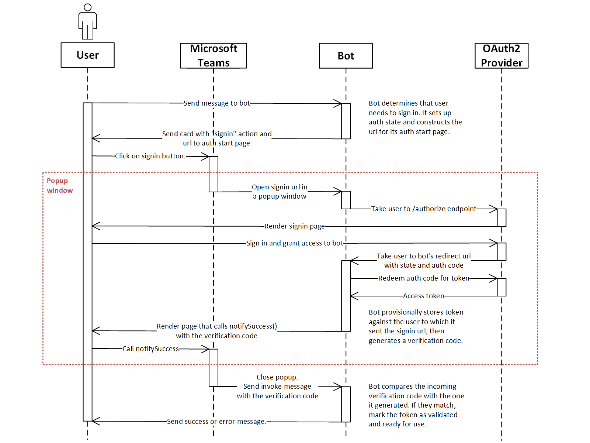
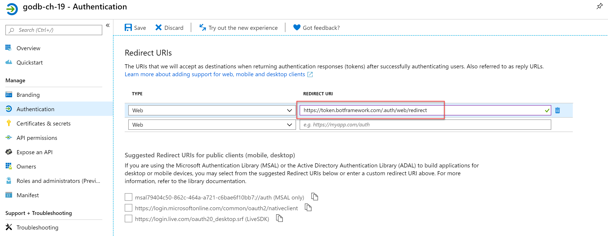

# Microsoft Teams - Bot Training
## Lab 3 - Authentication

Currently our Bot is public like a public website. In most cases we don't want this, especially for Teams Bots. In this lab we are going to setup Azure AD authenction for our Bot.

Before you start this lab setup the Bot like described in [Lab 1](./bot-lab-1.md)

### Bot Authentication Flow
This image illustrates the authentication we are going to implement.



## Configure the Bot Connector for OAuth
- Navigate to the Bot Channel Registration in Azure
- Settings -> Add Setting


- **Name:** "AzureAD"
- Choose: "**Azure Active Directory v2**"


> For demo purposes we can use her the same App Id and Password/Secret that we've used for the Bot Connector before. For production I recommend to create a separate App registration.

- **Client id**: App Id from Lab 1
- **Client secret**: App password from Lab 1
- **Tenant**: *name of you tenant e.g. mytenanat.com or use the "common" for multi tenant authentication*
- **Scopes**: "openid profile offline_access"
- Save
- Now naviagte in Azure to **Azure Active Directory** -> **App registrations**, open the App with the Id from above and add the folllowing redirect URL in the **Authentication**: `https://token.botframework.com/.auth/web/redirect`




## Implement Bot Authentication
Let's switch back to Visual Studio Code and build an OAuth Dialog:
- Add the Bot Builder Dialogs package to the project:

`dotnet add package Microsoft.Bot.Builder.Dialogs`
- Create a new folder with the name **Dialogs**
- In the just created folder create a new file called   **AuthDialog.cs**
- Copy & paste the following snippet into the file:
  

```CSharp
using System.Threading;
using System.Threading.Tasks;
using Microsoft.Bot.Builder;
using Microsoft.Bot.Builder.Dialogs;
using Microsoft.Bot.Schema;

namespace TeamsBot.Bots
{
    public class AuthDialog : ComponentDialog
    {
        public AuthDialog(string dialogId, string connectionName):base(dialogId)
        {
            AddDialog(new OAuthPrompt(
                nameof(OAuthPrompt),
                new OAuthPromptSettings
                {
                    ConnectionName = connectionName,
                    Text = "Please Sign In",
                    Title = "Sign In",
                    Timeout = 300000, // User has 5 minutes to login (1000 * 60 * 5)
                }));

            AddDialog(new ConfirmPrompt(nameof(ConfirmPrompt)));

            AddDialog(new WaterfallDialog(nameof(WaterfallDialog), new WaterfallStep[]
            {
                PromptStepAsync,
                LoginStepAsync,
                DisplayTokenPhase1Async,
                DisplayTokenPhase2Async,
            }));

            // The initial child Dialog to run.
            InitialDialogId = nameof(WaterfallDialog);
        }

        private async Task<DialogTurnResult> PromptStepAsync(WaterfallStepContext stepContext, CancellationToken cancellationToken)
        {
            return await stepContext.BeginDialogAsync(nameof(OAuthPrompt), null, cancellationToken);
        }

        private async Task<DialogTurnResult> LoginStepAsync(WaterfallStepContext stepContext, CancellationToken cancellationToken)
        {
            // Get the token from the previous step. Note that we could also have gotten the
            // token directly from the prompt itself. There is an example of this in the next method.
            var tokenResponse = (TokenResponse)stepContext.Result;
            if (tokenResponse != null)
            {
                await stepContext.Context.SendActivityAsync(MessageFactory.Text("You are now logged in."), cancellationToken);
                return await stepContext.PromptAsync(nameof(ConfirmPrompt), new PromptOptions { Prompt = MessageFactory.Text("Would you like to view your token?") }, cancellationToken);
            }

            await stepContext.Context.SendActivityAsync(MessageFactory.Text("Login was not successful please try again."), cancellationToken);
            return await stepContext.EndDialogAsync(cancellationToken: cancellationToken);
        }

        private async Task<DialogTurnResult> DisplayTokenPhase1Async(WaterfallStepContext stepContext, CancellationToken cancellationToken)
        {
            await stepContext.Context.SendActivityAsync(MessageFactory.Text("Thank you."), cancellationToken);

            var result = (bool)stepContext.Result;
            if (result)
            {
                // Call the prompt again because we need the token. The reasons for this are:
                // 1. If the user is already logged in we do not need to store the token locally in the bot and worry
                // about refreshing it. We can always just call the prompt again to get the token.
                // 2. We never know how long it will take a user to respond. By the time the
                // user responds the token may have expired. The user would then be prompted to login again.
                //
                // There is no reason to store the token locally in the bot because we can always just call
                // the OAuth prompt to get the token or get a new token if needed.
                return await stepContext.BeginDialogAsync(nameof(OAuthPrompt), cancellationToken: cancellationToken);
            }

            return await stepContext.EndDialogAsync(cancellationToken: cancellationToken);
        }

        private async Task<DialogTurnResult> DisplayTokenPhase2Async(WaterfallStepContext stepContext, CancellationToken cancellationToken)
        {
            var tokenResponse = (TokenResponse)stepContext.Result;
            if (tokenResponse != null)
            {
                await stepContext.Context.SendActivityAsync(MessageFactory.Text($"Here is your token {tokenResponse.Token}"), cancellationToken);
            }

            return await stepContext.EndDialogAsync(cancellationToken: cancellationToken);
        }
    }
}
```
- Open **Startup.cs** and ensure that the following services are added in the **ConfigureServices** method. We need them to persist the state of our auth dialog.
```CSharp
// Create the storage we'll be using for User and Conversation state. (Memory is great for testing purposes.)
services.AddSingleton<IStorage, MemoryStorage>();

// Create the User state. (Used in this bot's Dialog implementation.)
services.AddSingleton<UserState>();

// Create the Conversation state. (Used by the Dialog system itself.)
services.AddSingleton<ConversationState>();
```

- Now replace the code in **Bot.cs** with the following snippet:
  
```CSharp
using System.Threading;
using System.Threading.Tasks;
using Microsoft.Bot.Builder;
using Microsoft.Bot.Builder.Dialogs;
using Microsoft.Bot.Schema;

namespace TeamsBot.Bots
{
    public class Bot : ActivityHandler
    {
        // Connection name of out Azure Active Directory Provider in the Bot Channel Registration
        private const string ConnectioName = "AzureAD";
        private BotState conversationState;
        private UserState userState;
        private DialogSet dialogSet;

        // The services will automatically injected via dependency injection
        public Bot(ConversationState conversationState, UserState userState)
        {
            this.conversationState = conversationState;
            this.userState = userState;

            // Create a DialogSet and add our AuthDialog
            // We also need to create a DialogState to persits the state of the dialogs between diffretne turns
            this.dialogSet = new DialogSet(conversationState.CreateProperty<DialogState>(nameof(DialogState)));
            this.dialogSet.Add(new AuthDialog(nameof(AuthDialog), ConnectioName));
        }

        public override async Task OnTurnAsync(ITurnContext turnContext, CancellationToken cancellationToken = default(CancellationToken))
        {
            // Create a DialogContext
            var dc = await this.dialogSet.CreateContextAsync(turnContext);

            // Check if the Bot Framework has already a cached token for the current user and if there is already an AuthDialog active
            var tokenResponse = await ((BotFrameworkAdapter)turnContext.Adapter).GetUserTokenAsync(turnContext, ConnectioName, null, cancellationToken);
            if (tokenResponse == null)
            {
                // If not start the AuthDialog
                await dc.BeginDialogAsync(nameof(AuthDialog));
            }
            else
            {
                // If there is a token, countinue the AuthDialog
                await dc.ContinueDialogAsync();

                // Call the base class which triggers the activity handlers like "OnMessageActivityAsync"
                await base.OnTurnAsync(turnContext, cancellationToken);
            }

            // Persist state changes at the end of every turn
            await conversationState.SaveChangesAsync(turnContext, false, cancellationToken);
            await userState.SaveChangesAsync(turnContext, false, cancellationToken);
        }

        protected override async Task OnMessageActivityAsync(ITurnContext<IMessageActivity> turnContext, CancellationToken cancellationToken)
        {
            await turnContext.SendActivityAsync(MessageFactory.Text($"Echo: {turnContext.Activity.Text}"), cancellationToken);
        }
    }
}

```
The constructor automatically gets the services via dependency injection. We overwrite **OnTurnAsync** to implement our authentication. **OnTurnAsync** gets fired on any kind of event. If there isn't already a cached token for the user we start the AuthDialog.
At the end of **OnTurnAsync** we persist the state.

First test the Authentication in the emulator. The OAuth callback only works in the emulator when you have configured ngrok in the settings.

Afterwards give it a try in Teams.

Great! We have now an Azure AD token and can do awesome things with Microsoft Graph!


